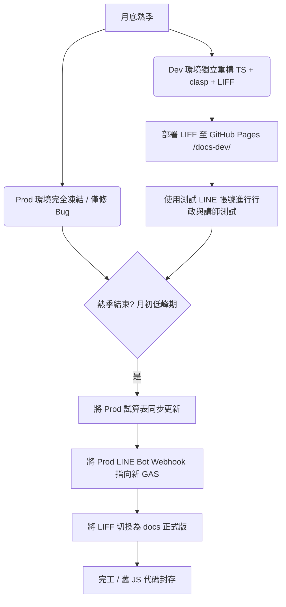

# 「空空BOT」開發環境基礎建設重構與 LIFF Web App 實作計畫

本計畫旨在依據 `doc/開發環境基礎建設懶人包.md` 重構本專案的開發環境，並參考 `_TRAVEL_APP` 專案，為「空空BOT」引進 **LINE Front-end Framework (LIFF) 網頁應用**。

這將徹底解決講師與秘書「**每個月操作一次，常常忘記指令格式與關鍵字**」的核心痛點，改以直覺、美觀且具備防呆機制的行動網頁進行課程登錄、請假與核銷操作。

---

## 1. 開發環境重構方案 (符合「懶人包」標準)

我們將調整專案結構，將程式碼區分為後端 GAS (`gas/`) 與前端 LIFF 網頁 (`docs/`，以便直接使用 GitHub Pages 託管)。

### 新增與調整的專案結構

```text
_空空BOT/
├── .clasp.json                  # 更新 rootDir 指向 gas/build
├── package.json                 # [NEW] 導入 npm 腳本 (gas:build, gas:push)
├── eslint.config.mjs            # [NEW] 導入 ESLint
├── doc/
│   ├── 開發環境基礎建設懶人包.md
│   ├── 空空BOT功能整理與優化建議.md
│   └── 空空BOT環境重構與LIFF實作計畫.md
├── gas/                         # [NEW] 後端 GAS TypeScript 開發目錄
│   ├── tsconfig.json            # [NEW] TS 編譯配置
│   ├── appsscript.json          # 移動自根目錄
│   ├── build/                   # 編譯輸出目錄 (clasp push 對象)
│   └── src/                     # 後端 TypeScript 原始碼
│       ├── Config.ts            # 將 Config.js 轉換為 TS，隱私改用 Script Properties
│       ├── Main_Controller.ts
│       ├── Core_Service.ts
│       ├── Leave_Service.ts
│       ├── UI_Utils.ts
│       ├── Finance_Service.ts
│       └── Doc_Service.ts
├── docs/                        # [NEW] 前端 LIFF 網頁目錄 (GitHub Pages 託管)
│   ├── index.html               # LIFF 主要入口網頁
│   └── config.js                # LIFF 與 GAS Web App 連接配置
└── scripts/                     # [NEW] 編譯輔助腳本
    └── copy_gas_manifest.mjs
```

### 專案屬性管理 (Script Properties)
原本在 `Config.js` 中寫死的 ID 與 Token，將在重構時完全移出代碼，改用 GAS 專案設定中的「指令碼屬性」進行保護，包含：
- `SPREADSHEET_ID` (主資料庫 ID)
- `LEAVE_SHEET_ID` (請假資料庫 ID)
- `REPORT_SHEET_ID` (財務報表 ID)
- `SHEET_ID_MEMBER` (會員名單 ID)
- `LINE_CHANNEL_TOKEN` (LINE 訊息 API Token)

---

## 2. LIFF Web App 設計方案 (參考 `_TRAVEL_APP`)

我們將利用 **Tailwind CSS CDN** + **Alpine.js** + **LINE LIFF SDK** 快速建置一個輕量化、免安裝的「空空BOT 操作平台」。

### A. 使用者體驗流程
1. **自動驗證身分**：講師/秘書點擊 LINE 聊天室的 Rich Menu 按鈕，開啟 LIFF 網頁。網頁自動透過 `liff.getProfile()` 取得 `lineUserId`，並發送 API 請求到 GAS。
2. **講師主頁**：若已綁定，畫面會顯示該講師的姓名、本月已登記堂數、以及待核銷的預排課程。
3. **登錄與預排課程**：
   - 提供「學生下拉選單」與「課程選單」（資料從 Google Sheets 動態載入，免除打字出錯）。
   - 提供美觀的日期選擇器 (DatePicker) 與時間滑塊/時間選擇器。
   - 點擊「送出」後，前端先驗證時間格式，GAS 後端進行「時段重疊檢查」，通過後直接寫入 Sheet。
4. **預排核銷**：
   - 顯示未核銷的預排課程清單（以卡片形式呈現）。
   - 講師可一鍵點擊「確認上課」或「取消未上課」進行核銷。
5. **請假功能**：
   - 顯示目前的剩餘假別與額度。
   - 提供請假表單（選擇假別、日期、時間段）。
6. **行政/秘書專區 (根據 Admin 權限動態顯示)**：
   - 如果偵測到目前使用者的 `lineUserId` 在 `ADMIN_LIST` 中，網頁將解鎖顯示「行政專用」分頁。
   - 提供「學費試算」、「鐘點試算」、「產生繳費單」、「開收據」、「記帳」等操作入口。

---

## 3. GAS 後端 API 調整 (doGet)

為支援 LIFF 網頁端，後端 GAS 需要在 `doGet(e)` 中增加處理 HTTP GET 請求的 API 路由，回傳 JSON 資料給前端：

```typescript
function doGet(e: GoogleAppsScript.Events.DoGet) {
  const action = e.parameter.action;
  const lineUserId = e.parameter.lineUserId;
  
  // 核心路由控制
  switch(action) {
    case "me":
      // 回傳目前使用者的綁定狀態、姓名、本月課程統計
      return ContentService.createTextOutput(JSON.stringify(handleLiffMe(lineUserId))).setMimeType(ContentService.MimeType.JSON);
    case "getFormOptions":
      // 回傳登錄表單所需的學生名單、課程科目選單
      return ContentService.createTextOutput(JSON.stringify(handleLiffFormOptions())).setMimeType(ContentService.MimeType.JSON);
    case "register":
      // 執行課程登錄或預排寫入
      return ContentService.createTextOutput(JSON.stringify(handleLiffRegister(e.parameter))).setMimeType(ContentService.MimeType.JSON);
    case "getUnverified":
      // 獲取該講師待核銷的預排課程
      return ContentService.createTextOutput(JSON.stringify(handleLiffGetUnverified(lineUserId))).setMimeType(ContentService.MimeType.JSON);
    case "verifySchedule":
      // 執行核銷
      return ContentService.createTextOutput(JSON.stringify(handleLiffVerifySchedule(e.parameter))).setMimeType(ContentService.MimeType.JSON);
    case "leave":
      // 執行請假寫入
      return ContentService.createTextOutput(JSON.stringify(handleLiffLeave(e.parameter))).setMimeType(ContentService.MimeType.JSON);
    default:
      return ContentService.createTextOutput(JSON.stringify({ ok: false, message: "Unknown action" })).setMimeType(ContentService.MimeType.JSON);
  }
}
```

---

## 4. 實作步驟與進度規劃

### 階段一：開發環境重構 (預計 1 天)
1. 建立 `gas/src` 與 `docs` 目錄，將現有專案結構移入。
2. 建立 `package.json`，安裝 clasp, typescript, eslint 與 Google Apps Script 類型宣告包。
3. 建立並配置 `tsconfig.json` 與 `.clasp.json`，測試 clasp 本地連線與推送是否正常。
4. 將 `.js` 原始碼更名為 `.ts`，修復 TypeScript 的型別宣告與相容性警報。
5. 將敏感 ID 從 `Config.ts` 抽離，寫入 GAS `Script Properties`。

### 階段二：GAS 後端 API 開發 (預計 1.5 天)
1. 實作 `doGet` 的 API 路由。
2. 實作 `handleLiffMe`，透過 `lineUserId` 在「講師名單」及「會員名單」中比對身份並判斷是否具有 `Admin` 權限。
3. 實作 `handleLiffFormOptions`，讀取試算表中可用的學生、課程與假別，供前端下拉選單使用。
4. 實作 `handleLiffRegister`（包含重疊檢查與寫入 Sheet）與 `handleLiffLeave`。

### 階段三：LIFF 網頁端前端開發 (預計 2.5 天)
1. 在 `docs/` 下建立 `index.html` 與 `config.js`。
2. 使用 Tailwind CSS CDN 設計專屬的精美 UI（包含講師看板、課程登錄表單、未核銷預排列表、請假表單、行政專屬操作面板）。
3. 整合 Alpine.js 管理前端狀態與表單雙向綁定。
4. 整合 LINE LIFF SDK，完成登入、權限獲取與身分驗證。
5. 連接 GAS API 進行完整對接測試。

### 階段四：測試、部署與 Rich Menu 串接 (預計 1 天)
1. 將前端 `docs` 託管至 GitHub Pages，取得專案 LIFF 網頁的實體 URL。
2. 在 LINE Developers 後台註冊 LIFF 應用，將 URL 綁定至 LIFF ID。
3. 設定 LINE 官方帳號的圖文選單 (Rich Menu)，將按鈕動作設為「開啟 LIFF URL」。
4. 交付測試。

---

## 5. 驗證與測試計畫

### 自動與本地驗證
- **TypeScript 編譯檢查**：本地端執行 `npm run gas:check` 確保語法與型別 100% 正確。
- **後端 API 測試**：使用 Postman 或瀏覽器直接調用 `https://script.google.com/macros/s/.../exec?action=me&lineUserId=U12345` 進行路由與資料讀取測試。

### 手動驗證流程
- **LIFF 登入測試**：於手機 LINE 聊天室開啟 LIFF，確認能順利載入使用者的 LINE 個人資料。
- **課程登記測試**：在 LIFF 點選學生、課程並輸入時間，送出後確認 Google Sheets 中「授課紀錄」能即時且正確地寫入，且格式無誤。
- **重疊防護測試**：刻意登記一個與現有課程重疊的時間，確認 LIFF 會收到「時段重疊」的錯誤提示並拒絕寫入。
- **行政權限測試**：
  - 非 Admin 講師登入：確認「行政專用」分頁完全不顯示。
  - Admin 登入：確認「行政專用」分頁會解鎖顯示，並能點擊觸發學費試算等操作。

---

## 6. 月底熱季安全並行方案 (雙軌部署、零中斷過渡)

為了在月底結算熱季期間，**不影響現有「空空BOT」的日常運作**，同時順暢地進行「環境重構」與「LIFF 研發」，我們必須實施「**雙軌平行開發 (Dual-Track Dev/Prod) 方案**」：

### A. 資源與環境徹底隔離
1. **正式環境 (現有環境 - Prod)**：
   - **程式碼**：保持根目錄的舊 `.js` 架構，絕對不進行 `clasp push`。
   - **LINE 帳號**：現有正式 LINE Bot 頻道與 Rich Menu。
   - **資料庫**：現有正式 Google Sheets。
   - **熱修復機制 (Hotfix)**：若月底熱季期間發生即時 bug，直接在線上 Apps Script 編輯器或根目錄舊 `.js` 中做最小幅度的修補與部署，不牽涉 any 重構程式碼。
2. **測試環境 (全新環境 - Dev) [NEW]**：
   - **專案結構**：在我們的新開發目錄中建立新的 `.clasp.json`，對應一個**全新的 Google Apps Script 專案 (獨立 Script ID)**。
   - **LINE 帳號**：在 LINE Developers 後台建立一個免費的 **「空空BOT - 測試版」** 頻道，Webhook 指向新 GAS 專案。
   - **資料庫**：將正式 Google Sheets 「複製一份」作為測試資料庫，並將其試算表 ID 設定於測試 GAS 的專案屬性中。

### B. 漸進式過渡與切換流程 (Migration Pipeline)


1. **開發與測試 (月底熱季期間)**：
   - 我們在新專案中完成 TypeScript 重構，並將 LIFF 網頁託管至 GitHub Pages 的測試路徑（例如 `/docs-dev/index.html`）。
   - 行政人員與特定講師可在「測試 LINE 帳號」中直接試用 LIFF 網頁登錄與請假，驗證資料是否確實寫入「複製版」試算表。這既不干擾月底結算，也能提前進行真實用戶驗證。
2. **無縫過渡 (下月初低峰期)**：
   - 當月底熱季結束、進入月初的低峰期時，我們進行正式切換：
     - 在正式 Google Sheets 中做好備份。
     - 將重構編譯後的後端程式碼一次性部署至正式的 GAS 專案（或是建立新正式部署）。
     - 將正式 LINE Bot 的 Webhook 指向新的 GAS 網頁應用程式 URL。
     - 將 GitHub Pages 的前端靜態路徑切換為正式版（例如 `/docs/index.html`）。
     - 在 LINE 後台套用全新的 Rich Menu。
3. **優勢**：
   - **0 風險**：開發期間 100% 隔離，正式環境不受任何影響。
   - **100% 信心度**：切換前已由真實在手機上透過測試 Bot 進行了完整 LIFF 操作與試算表寫入驗證。
   - **隨時可復原**：切換後若有意外，只需將 LINE Webhook 網址改回舊版 GAS，1秒內即可切回舊系統。
